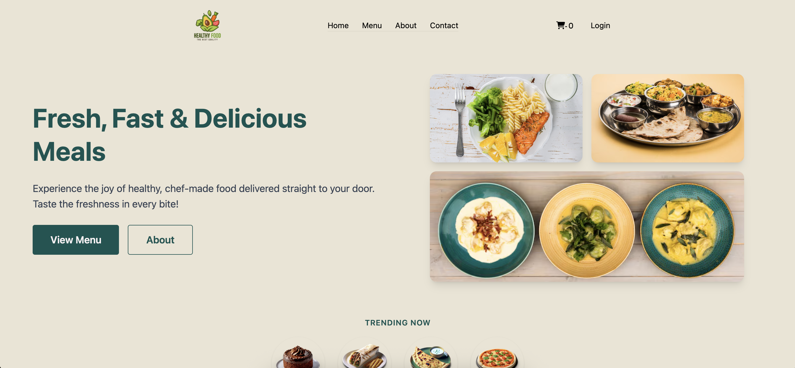
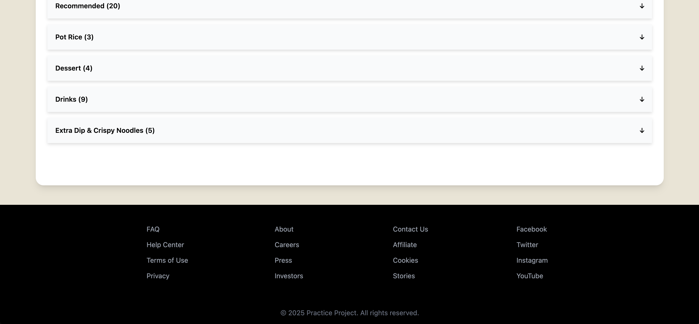
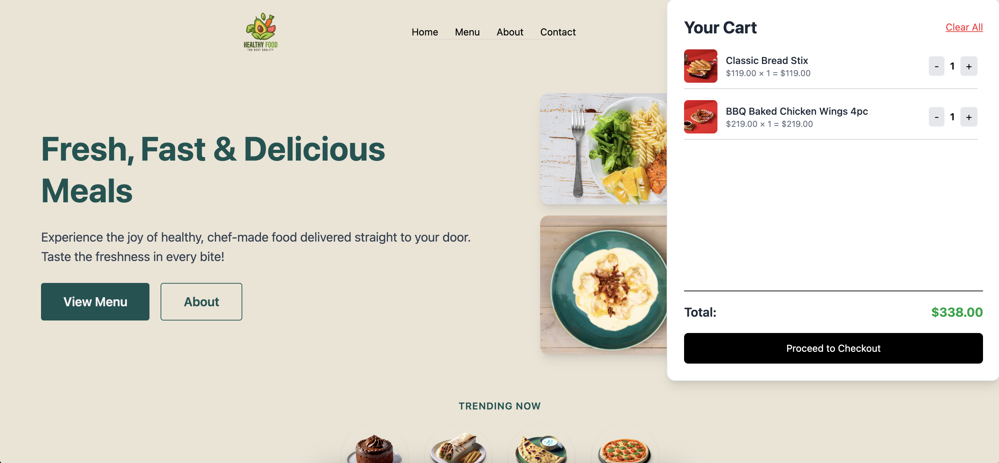
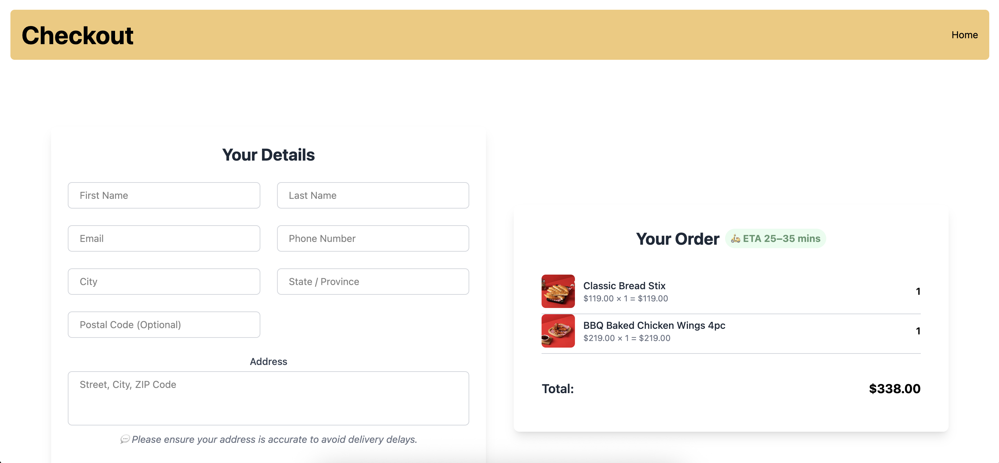
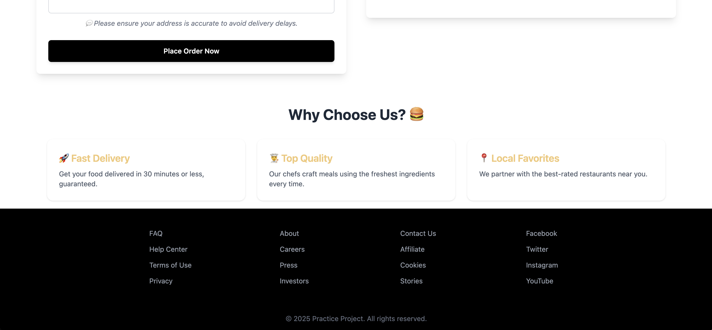
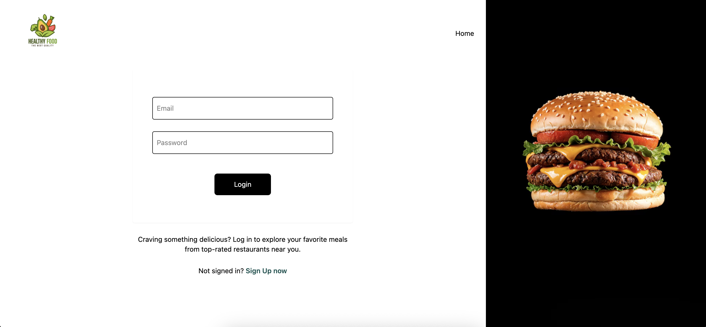
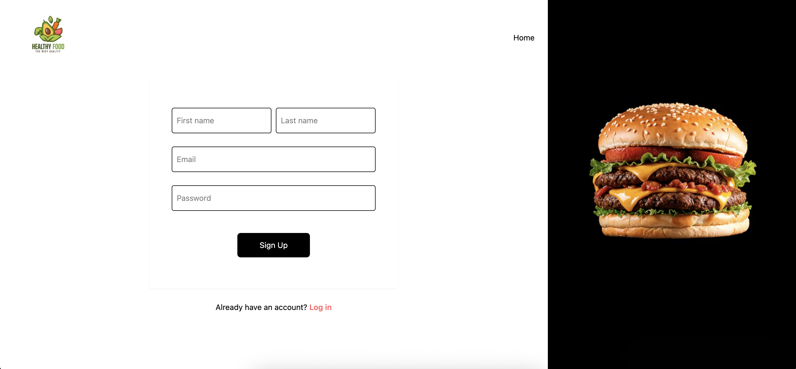

# 🍽️ Food Ordering Website

A responsive and modern food ordering app built with **React**, **Tailwind CSS**, and **Redux Toolkit**, mimicking real-time restaurant browsing and cart management.

## 🔗 Live Demo

👉 [Click to View Live](https://food-ordering-app-cc5dc.web.app/)

## Preview

## App Screenshots

###  Home Page()

###  About Section

### Menu Section

### Checkout

### Login/Signup

## 🚀 Features

- Browse restaurants with dynamic search
- Add/remove items from the cart
- Categorized and expandable restaurant menus
- Redux for global state management
- Unit testing with Jest and React Testing Library

## Tech Stack

- **Frontend:** React.js, Tailwind CSS, React Router
- **State Management:** Redux Toolkit
- **Testing:** Jest + React Testing Library
- **Deployment:** Firebase Hosting
- **Mock API:** Swiggy public API

